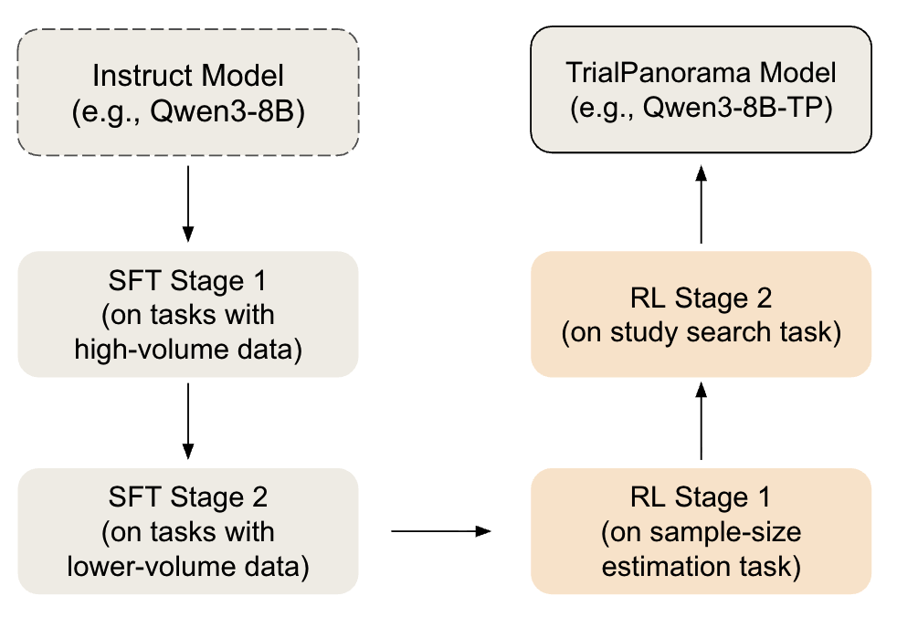

# TrialPanorama Training Guide

This document provides a comprehensive guide for training the TrialPanorama model using a two-stage Supervised Fine-Tuning (SFT) approach followed by a two-stage Reinforcement Learning from Verification and Reward (RLVR) training process.

## Training Pipeline

Our training pipeline consists of two main phases:

1. **Two-stage Supervised Fine-Tuning (SFT)**: Initial model training for knowledge injection
2. **Two-stage RLVR**: Reinforcement learning training for study search and sample size estimation tasks

The complete training pipeline is illustrated below:



## Phase 1: Supervised Fine-Tuning (SFT)

The SFT phase is based on the [LLaMA-Factory](https://github.com/hiyouga/LLaMA-Factory) codebase, which provides a unified framework for efficient fine-tuning of large language models.

### Step 1: Environment Setup

First, set up the training environment by following the instructions in [`train/sft/README.md`](sft/README.md). This includes installing all necessary dependencies and configuring the LLaMA-Factory environment.

### Step 2: Data Download

Download the training data from the HuggingFace dataset repository:

```bash
# Download data from HuggingFace
# Dataset: https://huggingface.co/datasets/TrialPanorama/Dataset
```

### Step 3: Data Processing

Process the downloaded data to match the required format. The processed data should follow the structure of `train/sft/processed_data/sample_size_train_cot.json`.

**Key points for data processing:**
- For data with reasoning steps, include the full chain-of-thought (CoT) reasoning process
- For data without reasoning, include only the final answer
- Ensure the data format matches the expected JSON structure

Example format:
```json
{
  "instruction": "...",
  "input": "...",
  "output": "..."
}
```

### Step 4: Data Merging

After processing individual datasets, merge them into stage-specific files:
- `stage_1.json`: First stage training data
- `stage_2.json`: Second stage training data

These merged files should be placed in `train/sft/processed_data/`.

### Step 5: Dataset Configuration

Add the corresponding dataset information to `train/sft/data/dataset_info.json`. This file maps dataset names to their file paths and formatting specifications.

Example entry:
```json
{
  "stage_1": {
    "file_name": "../processed_data/stage_1.json"
  },
  "stage_1_eval": {
    "file_name": "../processed_data/stage_1_eval.json"
  }
}
```

### Step 6: Create Recipe Files

Create recipe configuration files in `train/sft/recipe/`. These YAML files specify:
- Model configuration
- Training hyperparameters
- Dataset selection
- Output directories
- Evaluation settings

Example recipe structure:
```yaml
### model
model_name_or_path: /path/to/base/model
trust_remote_code: true

### method
stage: sft
do_train: true
finetuning_type: full

### dataset
dataset: stage_1
template: llama3
cutoff_len: 8192

### output
output_dir: /path/to/output
logging_steps: 10
save_steps: 1000
```

### Step 7: Run Training Scripts

Execute the training scripts located in `train/sft/scripts_train/`. For example:

```bash
# Stage 1 training
bash train/sft/scripts_train/llama3/train_stage_1.sh

# Stage 2 training (after Stage 1 completes)
bash train/sft/scripts_train/llama3/train_stage_2.sh
```

The training scripts will:
- Load the base model
- Train on the specified dataset
- Save checkpoints at regular intervals
- Log training metrics to WandB (if configured)

## Phase 2: Reinforcement Learning with Verifiable Reward (RLVR)

The RLVR phase uses the [VERL framework](https://github.com/volcengine/verl) for reinforcement learning training. This phase fine-tunes the SFT model on two specific tasks: study search and sample size estimation.

### Prerequisites

- Completed SFT training with saved model checkpoints
- Processed RLVR data (already available in `train/rlvr/data/`)

### Data Structure

The RLVR data is organized as follows:
- `train/rlvr/data/sample_size_estimation/`: Sample size estimation training data
- `train/rlvr/data/study_search/`: Study search training data

Each directory contains:
- `train.parquet`: Training data
- `test.parquet`: Test data
- `val.parquet`: Validation data

### Training Scripts

Training scripts are located in `train/rlvr/script_train/`:
- `train_study_search.sh`: Study search RL training
- `train_sample_size_estimation.sh`: Sample size estimation RL training

### Running RLVR Training

#### Study Search Training

Create a training script similar to the following:

```bash
#!/bin/bash

export N_GPUS=4
export BASE_MODEL=[Path to SFT model checkpoint]
export DATA_DIR=train/rlvr/data/study_search
export ROLLOUT_TP_SIZE=4
export EXPERIMENT_NAME=study-search-llama3-8b-${N_GPUS}gpus
export VLLM_ATTENTION_BACKEND=XFORMERS
export WANDB_API_KEY="[Your WandB API key]"
export HF_HOME=[Path to HuggingFace cache directory]
export PROJECT_NAME="TrialPanorama-R1"

export CUDA_VISIBLE_DEVICES=0,1,2,3

bash train/rlvr/script_train/train_study_search.sh
```

#### Sample Size Estimation Training

```bash
#!/bin/bash

export N_GPUS=4
export BASE_MODEL=[Path to SFT model checkpoint]
export DATA_DIR=train/rlvr/data/sample_size_estimation
export ROLLOUT_TP_SIZE=4
export EXPERIMENT_NAME=sample-size-estimation-llama3-8b-${N_GPUS}gpus
export VLLM_ATTENTION_BACKEND=XFORMERS
export WANDB_API_KEY="[Your WandB API key]"
export HF_HOME=[Path to HuggingFace cache directory]
export PROJECT_NAME="TrialPanorama-R1"

export CUDA_VISIBLE_DEVICES=0,1,2,3

bash train/rlvr/script_train/train_sample_size_estimation.sh
```

### Environment Variables

- `N_GPUS`: Number of GPUs to use for training
- `BASE_MODEL`: Path to the SFT model checkpoint (should be a HuggingFace format model)
- `DATA_DIR`: Path to the training data directory (study_search or sample_size_estimation)
- `ROLLOUT_TP_SIZE`: Tensor parallelism size for rollout workers
- `EXPERIMENT_NAME`: Name for the experiment (used for logging and checkpoint naming)
- `VLLM_ATTENTION_BACKEND`: Attention backend for vLLM (typically XFORMERS)
- `WANDB_API_KEY`: Your WandB API key for experiment tracking
- `HF_HOME`: HuggingFace cache directory
- `PROJECT_NAME`: WandB project name
- `CUDA_VISIBLE_DEVICES`: Comma-separated list of GPU indices to use

### Training Process

The RLVR training process:
1. Loads the SFT model checkpoint as the base model
2. Uses GRPO (Group Relative Policy Optimization) algorithm
3. Trains with custom reward functions:
   - `reward_func/study_search.py` for study search
   - `reward_func/sample_size_estimation.py` for sample size estimation
4. Saves checkpoints at regular intervals
5. Logs training metrics to WandB

## Training Workflow Summary

1. **SFT Stage 1**: Train base model on stage 1 data
2. **SFT Stage 2**: Continue training on stage 2 data (using Stage 1 checkpoint)
3. **RLVR Study Search**: Fine-tune SFT model for study search task
4. **RLVR Sample Size**: Fine-tune SFT model for sample size estimation task

Each stage builds upon the previous one, progressively improving the model's performance on clinical trial-related tasks.

## Additional Resources

- [LLaMA-Factory Documentation](https://github.com/hiyouga/LLaMA-Factory)
- [VERL Framework Documentation](https://github.com/volcengine/verl)
- [TrialPanorama Dataset](https://huggingface.co/datasets/TrialPanorama/Dataset)

## Troubleshooting

### Common Issues

1. **Out of Memory**: Reduce batch size or use gradient checkpointing
2. **Data Format Errors**: Verify data format matches expected structure
3. **Model Loading Issues**: Ensure model path is correct and model is in HuggingFace format
4. **WandB Logging**: Verify API key and project name are correct

For more detailed troubleshooting, refer to the respective framework documentation.

